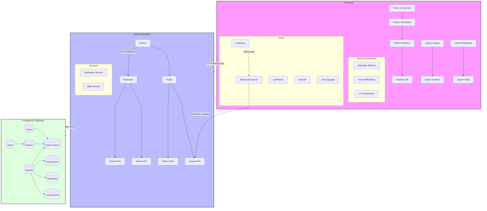

Key Features:
1. Frontend:
   - React components with responsive design
   - Real-time queue updates via WebSocket
   - Form handling with shadcn components
   - Multi-language support
   - Protected routes for admin/doctor access

2. Backend:
   - Express server with route protection
   - WebSocket server for real-time updates
   - Authentication middleware
   - SMS and notification services
   - API routes for patients, doctors, and admin

3. Database:
   - PostgreSQL with Drizzle ORM
   - Related tables for comprehensive patient management
   - Queue tracking system
   - Medical records storage
   - User authentication data

Data Flow:
1. Patient Flow:
   - Patient verification → Selection → Queue Entry → Payment
   - Real-time queue status updates via WebSocket
   - Consultation tracking and medical record updates

2. Doctor Flow:
   - Authentication → Patient list → Queue management
   - Medical record creation and updates
   - Prescription and diagnosis management

3. Admin Flow:
   - Queue management and monitoring
   - Patient data management
   - Clinic operations oversight
