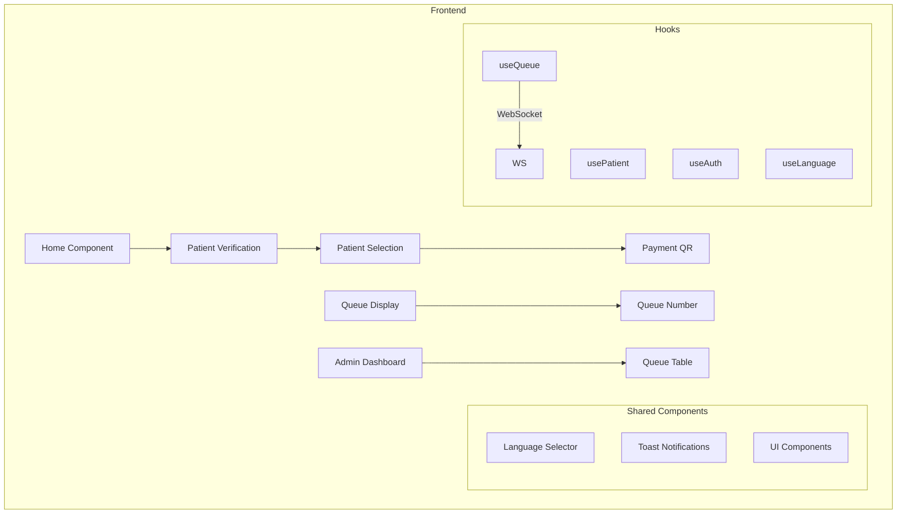
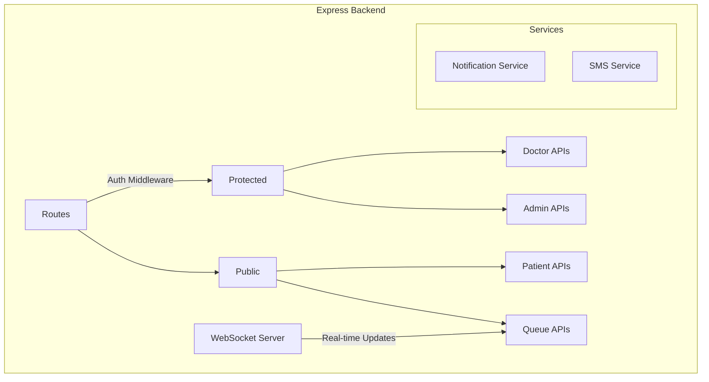
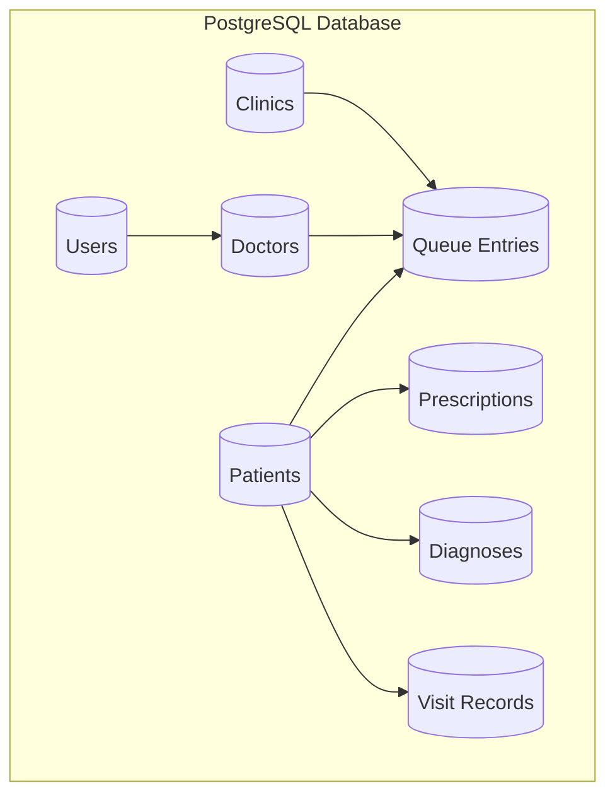

# CloudCare Model X1 Architecture

## Overview
CloudCare Model X1 is a comprehensive healthcare platform designed to streamline digital health services with a focus on robust patient management and seamless clinic workflows.

## Core Components

### Frontend Architecture

### Backend Architecture

### Database Schema

## Key Features
1. Patient Management
   - Patient registration and verification
   - Queue management
   - Medical history tracking
   - Payment processing

2. Doctor Portal
   - Real-time queue management
   - Patient consultation tracking
   - Prescription management
   - Performance analytics

3. Clinic Management
   - Staff management
   - Queue configuration
   - Analytics and reporting
   - Resource scheduling

## Testing Strategy
1. Unit Tests
   - Individual component testing
   - Service layer testing
   - API endpoint testing

2. Integration Tests
   - End-to-end workflows
   - WebSocket communication
   - Database operations

3. UI Tests
   - Component rendering
   - User interactions
   - Responsive design

## Development Guidelines
1. Code Organization
   - Feature-based directory structure
   - Shared components and utilities
   - Clear separation of concerns

2. Testing
   - Test-driven development approach
   - Comprehensive test coverage
   - Automated testing pipeline

3. Documentation
   - Inline code documentation
   - API documentation
   - Component storybook
